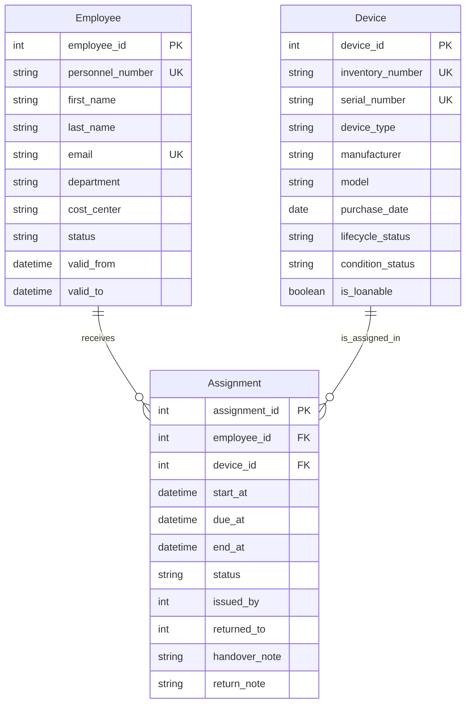

# Domänenmodell: Geräteausleihe

## Fachlicher Kontext
- Mitarbeitende leihen Geräte aus.
- Geräte besitzen Stammdaten und einen aktuellen Zustand.
- Jede Ausleihe soll historisch nachvollziehbar sein.
- Prozesse wie Ausgabe, Rückgabe, Verlängerung und Gerätewechsel sollen dokumentierbar sein.

## Kernobjekte (Aggregate/Entitäten)

### 1) Mitarbeiter (Employee)
Repräsentiert eine ausleihberechtigte Person.

Fachliche Attribute (Beispiele):
- `employee_id` (fachlicher Schlüssel, z. B. Personalnummer)
- `first_name`, `last_name`
- `email` (dienstlich)
- `department`
- `cost_center` (optional)
- `status` (aktiv, inaktiv)
- `valid_from`, `valid_to` (optional für zeitliche Gültigkeit)

### 2) Gerät (Device)
Repräsentiert ein physisches oder klar identifizierbares ausleihbares Objekt.

Fachliche Attribute (Beispiele):
- `device_id` (interne ID)
- `inventory_number` (Inventarnummer, eindeutig)
- `serial_number` (Seriennummer, i. d. R. eindeutig pro Hersteller)
- `device_type` (Laptop, Monitor, Smartphone, ...)
- `manufacturer`, `model`
- `purchase_date` (optional)
- `lifecycle_status` (im Bestand, in Reparatur, ausgesondert, verloren)
- `condition_status` (neu, gut, gebraucht, defekt)
- `is_loanable` (fachliche Freigabe zur Ausleihe)

### 3) Ausleihvorgang (Assignment)
Repräsentiert die Zuweisung eines Geräts an eine Person über einen Zeitraum.

Fachliche Attribute (Beispiele):
- `assignment_id`
- `device_id` (Referenz auf Gerät)
- `employee_id` (Referenz auf Mitarbeiter)
- `start_at` (Beginn der Zuweisung)
- `due_at` (geplantes Ende, optional)
- `end_at` (tatsächliches Ende, bei Rückgabe gesetzt)
- `status` (aktiv, beendet, storniert)
- `issued_by` (wer hat ausgegeben)
- `returned_to` (wer hat zurückgenommen, optional)
- `handover_note` (optional)
- `return_note` (optional)

## Mermaid-ERD

## Fachregeln (R1 .. R10)

Regeln, die sich nicht oder nicht vollständig im ERD ausdrücken lassen:

- R1: Ein Gerät darf zu einem Zeitpunkt maximal eine aktive Zuweisung haben.
- R2: Eine aktive Zuweisung liegt vor, wenn `status = aktiv` und `end_at` nicht gesetzt ist.
- R3: Zeitintervalle von Zuweisungen desselben Geräts dürfen sich nicht überschneiden.
- R4: Neue Zuweisungen sind nur erlaubt, wenn das Gerät `is_loanable = true` und `lifecycle_status = im Bestand` hat.
- R5: Mitarbeitende mit `status = inaktiv` dürfen keine neue Zuweisung erhalten.
- R6: Für beendete Zuweisungen gilt `end_at >= start_at`.
- R7: Wenn `due_at` gesetzt ist, gilt `due_at >= start_at`.
- R8: Statuswechsel sind nur in fachlich zulässigen Pfaden erlaubt, mindestens `aktiv -> beendet` und optional `aktiv -> storniert`.
- R9: Beendete Zuweisungen werden nicht physisch gelöscht, sondern nur fachlich storniert oder korrigiert (Auditierbarkeit).
- R10: Bei Rückgabe wird der Gerätezustand (`condition_status`) geprüft und bei Bedarf aktualisiert.

## UK- und Constraint-Ideen

### Unique Keys (UK)

- `employees.personnel_number` eindeutig.
- `employees.email` eindeutig (optional als partieller UK nur für aktive Mitarbeitende).
- `devices.inventory_number` eindeutig.
- `devices.serial_number` eindeutig (optional je Hersteller, falls gleiche Seriennummern über Hersteller hinweg möglich sind).

### Prüfbarkeits- und Integritäts-Constraints

- `CHECK (status IN ('aktiv', 'beendet', 'storniert'))` auf `assignments`.
- `CHECK (end_at IS NULL OR end_at >= start_at)` auf `assignments`.
- `CHECK (due_at IS NULL OR due_at >= start_at)` auf `assignments`.
- `CHECK ((status = 'aktiv' AND end_at IS NULL) OR (status <> 'aktiv' AND end_at IS NOT NULL))` auf `assignments`.
- `CHECK (lifecycle_status IN ('im Bestand', 'in Reparatur', 'ausgesondert', 'verloren'))` auf `devices`.
- `CHECK (condition_status IN ('neu', 'gut', 'gebraucht', 'defekt'))` auf `devices`.

### Exklusivität aktiver Assignment

- Partielle Eindeutigkeit, z. B. `UNIQUE (device_id) WHERE status = 'aktiv'`.
- Falls auch Zeitüberlappung verhindert werden soll: DB-spezifische Exclusion-Constraint auf Zeitbereich und `device_id`.

### Referenzielle Integrität

- `assignments.employee_id -> employees.employee_id` (FK).
- `assignments.device_id -> devices.device_id` (FK).
- `ON DELETE RESTRICT` für Stammdaten, damit Historie nicht unabsichtlich zerstört wird.

